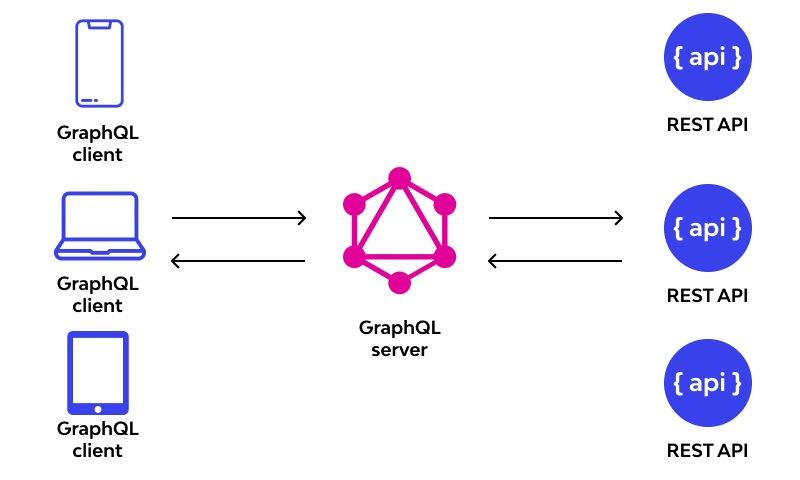
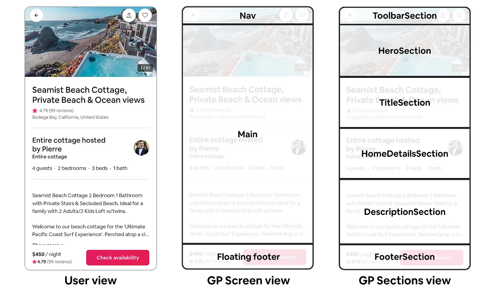

# 🔥 REST API 때려치우고 GraphQL, Apollo Server 도입한 후기

안녕하세요!
알바몬제트개발팀의 김규리입니다.
오늘은 Server Driven UI 파일럿를 진행하며 GraphQL, Apollo Server를 도입하게 된 과정을 공유하고자 합니다.
가볍게 읽어주시면 감사할 것 같습니다😄

## 😱 프롤로그: "GraphQL과 첫 번째 기억"

때는 제가 0년차 개발자이던 시절...(2021년 정도)

첫 회사에 다녔던 병아리 개발자인 저는 아무것도 알지 못했지만 그래도 가끔 이런 생각을 했던 것 같습니다.

"이거 뭔가 비효율적인 것 같은데..."

프론트엔드에서는 데이터의 일부만 필요한데, 백엔드는 전체 데이터를 다 보내주고 있었습니다.

<!-- 피드백 :: <14-16의 라인 말을 섞어보기> -->

예를 들어, 프론트엔드는 상품의 가격 정보만 있으면 되는데 백엔드에서 상품의 모든 정보와 판매자 및 구매자의 정보까지 모조리 보내주고 있었습니다.

처음에는 체감상 큰 문제는 없어서 방치했습니다. 하지만 해당 API는 다른 기능에서도 사용되고 있었기에 요구사항에 따라 변경되었고, 이에 따른 JOIN 쿼리가 많아지면서 문제가 생기기 시작했습니다.


이 페이지에 보여줄건 가격 정보 단 하나인데 왜 이렇게 느리고 뚱뚱한 데이터를 받아서 페이지가 느려져야 하는지 억울한 마음이 들었습니다.

이것은 오버패칭이라고 불리는 REST API의 문제 중 하나인데 해결하기 위한 방법 중 하나는 바로 필요한 데이터만 받아오는 API를 새로 만드는 것이었습니다!
와 정말 놀랍다...~~귀찮다~~

<!-- "" //대사 추가 친구와 대화하다 알게되었다는 느낌으로 -->
<!--  -->

그러다 어느 날... GraphQL이라는 것을 알게되었습니다.


<!-- // 너무 빨리 넘어가면 안되는 부분 : 독자가 설득이 안됨 -->

<!-- // GraphQL을 알게 되었는데 찾아보니 이런 장점과 단점이 있는데 이런건 해결할 수 있는 장점들이다. 내가 깨달은 것 처럼 작성하기 -->

사실 GraphQL은 2019년도 부터 존재하고 있었고 오버패칭 문제를 해결할 수 있었습니다.

이것을 알게되었고 당시 서버를 Spring Boot를 사용하고 있었는데 겁도 없이 패기롭게 연동~~하려고~~했습니다
결과적으로 말하자면 실패했고... 이것보다 더 급한 일들이 밀려들어왔기에 더 파고들 시간이 없었습니다.

모르는 것은 모른다고 말하고 모르는 것을 알아가는 것이 개발자의 삶 아니겠습니까?

이때부터 GraphQL은 완수하지 못한 과제처럼 마음 한구석에 남아있었던 것 같습니다.

만 2년의 시간이 흐르고 3년차가 된 지금,
지금 회사에서 사수님께서 라는 기술을 이야기해주셨습니다.

<!-- 이 기술을 이야기 하게 된 서사를 더 써보기 -->

<!-- 이벤트 템플릿이 정형화 되어있지 않고 메인 화면에 변경점이 많음
이 바뀌는 것들을 좀 더 수월하게 해보고싶다고 사수님이 말씀하셨다
팀원들끼리 이야기를 해보니까
이런게 있고
그때 요거를 도입을 해보면 어떻겠냐고 진행이 되어서
그래프큐엘을 써보면 좋을것같다는 생각을 했다. -->

그리고 그것이 GraphQL 과 조합이 좋다는 것을 알게된 순간 저는 완수하지 못한 과제를
이번에야 말로 해봐야 겠다는 생각을 했습니다.

보여줄게 0년차와 달라진나

까짓거 한 번 해보기로 했습니다.😎


우리 팀은 알바몬에서 SDUI가 필요한 상황을 재현해보고 파일럿을 진행했습니다.

## 🎯 Episode 1: SDUI가 뭔데? (사실 이미 쓰고 있었을 지도)

<!-- 우리의 상황에 대한 설명이 필요 -->
<!-- 우리가 왜 이런 기술을 써야하는지 설명 -->

<!-- 그래서 도입한 것이 SDUI이다. 하고 싶은 말이 많은데... 이건 기대해 주세요 라고 끝냄. -->

간단하게 SDUI (Server Driven UI)이라는게 뭔지부터 짚고 넘어가겠습니다.

어렵게 생각할 것 없이 말 그대로 서버에서 데이터를 조작해서 프론트엔드에 뿌려주는 것입니다.

개념 자체로만 보자면 우리는 이미 Server Driven한 UI를 작성하고 있었을 수도 있습니다. 예를 들어,캐러셀 데이터나 목록 데이터를 백엔드에서 가져와 프론트엔드에 뿌려주는 등의 작업이 있습니다.

이것을 좀 더 심화해서 UI 구조를 서버에서 제어할 수 있도록 만들면 더 SDUI 스러운 시스템을 만들 수 있겠죠.

예를 들자면, 카드 리스트의 row와 column을 자유자재로 바꾸고, 배너의 높이나 버튼을 앱/프론트엔드 배포하지 않고 서버에서 제어할 수 있으면 좋을 것 같지 않나요?

다만, 이 SDUI의 설게에는 개발자의 경험과 요구사항이 크게 좌우하기 때문에 여러 관계자들과 많은 논의가 필요해보였습니다. SDUI에 대한 자세한 내용은 추후 블로그 글에 써보도록 하겠습니다.

이번 시간에는 이런 것이 있다는 것만 알아 두고 GraphQL과 Apollo Server에 대해 이야기 해보겠습니다.

## 🎯 Episode 2: GraphQL이란?


이미지 출처: https://www.wallarm.com/what/what-is-graphql-definition-with-example

GraphQL은 쿼리 언어입니다. 쿼리 언어라는 것은 데이터를 조회하는 언어라는 것을 의미합니다.
기존의 일반적으로 데이티 조회는 백엔드에서 하는 작업이었는데, 이 역할이 프론트엔드로 넘어오게 된 것 입니다.

GraphQL을 사용하는 회사로 대표적으로 Airbnb가 있는데 아래 그림을 한 번 보시죠!


출처 : A Deep Dive into Airbnb’s Server-Driven UI System
https://medium.com/airbnb-engineering/a-deep-dive-into-airbnbs-server-driven-ui-system-842244c5f5

이미지는 Airbnb의 서버 드리븐 UI 시스템입니다.
보시면 각각의 섹션을 나누고 그 안에 데이터를 넣어 놓은 것을 볼 수 있습니다.
추후에 필요한 섹션을 정하고 순서대로 데이터를 넣어 놓으면 프론트엔드에서는 그대로 뿌려주는 것입니다.

그럼 우리도 할 수 있지 않을까!?!?!

이와 비슷하게 알바몬에서 적용할 수는 없을까 고민해보았습니다.

- 타이틀
- 이미지
- 버튼

 // 우리꺼를 section을 나누어서 설명 + 스키마도 추가

요즘 광고 여기저기서 볼 수 있는 핫하신 변우석 님의 얼굴이 담긴 이벤트 페이지 입니다.
이 이벤트 페이지를 섹션으로 나누자면 세 가지로 나눌 수 있습니다.

이것을 GraphQL 스키마로 구성해보면 다음과 같습니다.

<!-- 접는 기능으로 -->

```tsx
type Query {
  getEventPage: EventPage
}

type EventPage {
  title: Title
  image: Image
  button: Button
}

type Title {
  text: String!
  color: String
  size: Int
}

type Image {
  url: String!
  alt: String
  width: Int
  height: Int
}

type Button {
  text: String!
  link: String!
  color: String
  backgroundColor: String
}
```

이 스키마를 따라 데이터를 가져올 리졸버를 구성합니다.
실제 프로덕션 환경에서는 데이터베이스나 외부 API에서 데이터를 가져오도록 수정하시면 됩니다.

```tsx
const eventPageResolver = {
  Query: {
    getEventPage: () => ({
      title: {
        text: "TVC 플러팅 챌린지",
        color: "#000000",
        size: 24,
      },
      image: {
        url: "https://example.com/event-image.jpg",
        alt: "잘생긴 우석 사진",
        width: 800,
        height: 400,
      },
      button: {
        text: "앱에서 칠린지 참여하기",
        link: "/events/2024",
        color: "#FFFFFF",
        backgroundColor: "#FF0000",
      },
    }),
  },
};

export default eventPageResolver;
```

이렇게 완성한 이벤트 페이지의 리졸버를 메인 리졸버에 통합 시킵니다

```tsx
import eventPageResolver from "./eventPage";

const resolvers = {
  Query: {
    ...eventPageResolver.Query,
  },
};

export default resolvers;
```

끝

단일 엔드포인트로 구성되기에 URI를 지정할 필요도 없습니다.
이러면 백엔드 구성은 끝났습니다.

진짜로?

이제 클라이언트는 쿼리 요청을 보낼 수 있습니다.

```tsx
query GetEventPage {
  getEventPage {
    title {
      text
      color
      size
    }
    image {
      url
      alt
      width
      height
    }
    button {
      text
      link
      color
      backgroundColor
    }
  }
}
```

그런데 만약에 여기서 모든 데이터가 다 필요 없는 경우가 발생할 수 있잖아요?
그러면 필요한 필드를 선택적으로 가져올 수 있습니다.

```tsx
query GetEventPageMinimal {
  getEventPage {
    title {
      text
    }
    button {
      text
      link
    }
  }
}
```

AMAZING !!

<!-- 이미지 추가 -->

이처럼 GraphQL에는 스키마, 리졸버, 쿼리, 뮤테이션 등의 개념이 있습니다.

이 작업에서 느낄 수 있는 GraphQL을 장점은 이렇습니다.

1. 필요한 데이터만 요청 가능
2. 강력한 타입 시스템
   - 스키마를 통해 데이터의 형태를 명확하게 정의합니다
3. 단일 엔드포인트

(출처: https://www.ibm.com/kr-ko/topics/graphql)

백엔드에서 뷔페 식탁을 차려놓으면 프론트엔드에서는 먹고싶은 것만 골라서 가져옵니다.
REST API가 미리 정해진 세트 메뉴라면, GraphQL은 원하는 만큼만 담아갈 수 있는 뷔페인 셈입니다.

<!-- 세트 메뉴, 뷔페 사진 추가 -->


백엔드가 차려놓은 백첩반상을 프론트가 다 먹을 필요가 없어졌어요.
먹고싶은 것, 좋아하는 것, 필요한 것만 쏙쏙 뽑아먹을 수 있게 되었습니다.

다이어트 성공

<!-- 다이어트 성공 사진 -->

## 🎯 Episode 3: Apollo Server vs GraphQL Yoga

GraphQL이 뭔지는 대강 보여드린것 같으니, 얘를 적용하기 위한 서버가 필요하겠죠?

어떤 서버를 사용해볼까 고민을 했다.

이 쿼리 언어를 사용하기 위해서는 필요한 서버를 구축해보겠습니다.

선택할 수 있는 프레임워크 중 큰 파이를 차지 하고 있는 두 가지가 있는데 Apollo Server와 GraphQL Yoga입니다.

[YOGA 사진]

처음에는 입문으로 GraphQL Yoga를 선택했었습니다. 실제로 써봤을 때 구축도 쉬웠고, 문서도 잘 되어있었습니다.

하지만 결국 Apollo Server를 선택하게 되었습니다.

왜?

1. 더 풍부한 커뮤니티와 레퍼런스

gihtub star 수가 더 많은 것은 사용자가 더 많다는 것이고, 그만큼 더 풍부한 커뮤니티와 지원 기능과 업데이트가 많을 가능성이 높습니다. 많은 사람들이 사용하며 단점이 보완되었을테니 우리가 적용했을 때 오류가 적을 확률이 높을듯.

(24년 11월 26일 당시)
Apollo Server : 13.8k
Yoga : 8.3k

<!-- 스타 수를 이미지로 추가 -->

출처
https://github.com/dotansimha/graphql-yoga
https://github.com/apollographql/apollo-server

2. 다양한 기업의 실제 프로덕션 사례

일단 에어비앤비에서 사용하고 있는 것을 보고 신뢰감을 얻었습니다.
뭔지 정확하게 알 수는 없지만 아무튼 대규모 서비스의 기업에서 프로덕션까지 올렸으니 신뢰해도 좋다고 생각했습니다.

출처 네이버 DEVIEW 2020 GraphQL이 가져온
에어비앤비 프론트엔드 기술의 변천사
https://deview.kr/data/deview/session/attach/GraphQL%E1%84%8B%E1%85%B5_%E1%84%80%E1%85%A1%E1%84%8C%E1%85%A7%E1%84%8B%E1%85%A9%E1%86%AB_%E1%84%8B%E1%85%A6%E1%84%8B%E1%85%A5%E1%84%87%E1%85%B5%E1%84%8B%E1%85%A2%E1%86%AB%E1%84%87%E1%85%B5_%E1%84%91%E1%85%B3%E1%84%85%E1%85%A9%E1%86%AB%E1%84%90%E1%85%B3%E1%84%8B%E1%85%A2%E1%86%AB%E1%84%83%E1%85%B3_%E1%84%80%E1%85%B5%E1%84%89%E1%85%AE%E1%86%AF%E1%84%8B%E1%85%B4_%E1%84%87%E1%85%A7%E1%86%AB%E1%84%8E%E1%85%A5%E1%86%AB%E1%84%89%E1%85%A1_1106.pdf

3. 프로덕션 환경을 고려하였을 때 다양한 요구사항에 대응 가능

Apollo Server는 **플러그인 시스템**이 있어 기능 확장성이 좋다고 느껴졌습니다.

회사에 와서 모듈 페더레이션에 대한 이야기를 참 많이 들었는데요. Apollo Server도 Federation 아키텍처를 지원하고 있었습니다.

- 기능 확장성 : 플러그인 시스템을 통해 기능을 쉽게 확장할 수 있어, 복잡한 요구사항을 충족하는데 유리합니다.
  출처
  https://the-guild.dev/graphql/yoga-server/docs/comparison
  https://npm-compare.com/ko-KR/apollo-server-express,
- 분산 시스템 지원을 위한 Federation 아키텍처
  https://velog.io/@banjjoknim/Apollo-GraphQL-Federation

물론 GraphQL Yoga도 기본적인 기능을 제공하기에 문제없고 무척 구축이 간편한 프레임워크지만, 대규모 서비스 환경에서는 Apollo Server의 안정성과 확장성이 더 큰 장점이 있다는 것을 고려하여 Apollo Server를 선택했습니다.

~~근데 사이드 플젝처럼 가볍고 빠른 프로토타이핑이 필요할 경우에는 Yoga를 선택할 것 같습니다. 2024 트렌드를 보니 Yoga 선택률이 더 높음~~
https://npm-compare.com/ko-KR/apollo-server,express-graphql,graphql,graphql-yoga/#timeRange=ALL

## 😏 Episode 4: 쿼리 대신 짜주는 Playground

플레이 그라운드에 대한 설명 솰라솰라
좀 더 추가하기

## 🚀 Episode 5: 그래서 결과는?

### Before

- 오버패칭으로 인한 불필요한 데이터 전송
- 복잡한 REST 엔드포인트들

### After

- 필요한 데이터만 쏙쏙
- 단일 엔드포인트의 자유로움

## 🎯 마치며: 앞으로 뭐할건데

<!-- SDUI 완성형을 만들고
알바몬에 도입할 수 있는 방법을 모색하고
어떻게 구성하면 좋을지 고민하는 사진이 있으면 좋겠다

어디다 넣을지 고민하는 어디에 어덯게 구성하지?
보완할 것은 무엇인지?
poc에 들어가기 위해서는 어떻게 해야할지? -->
